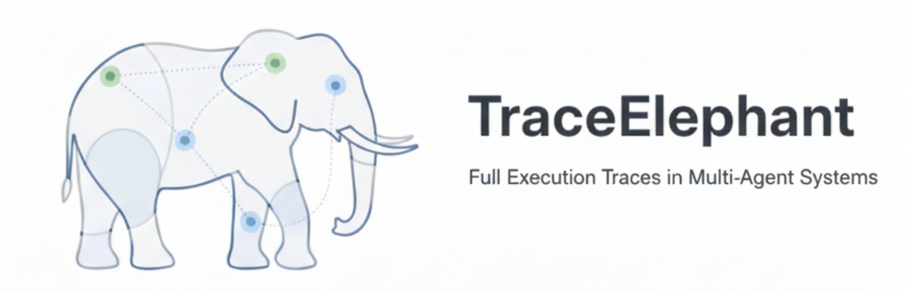
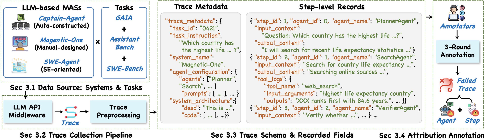
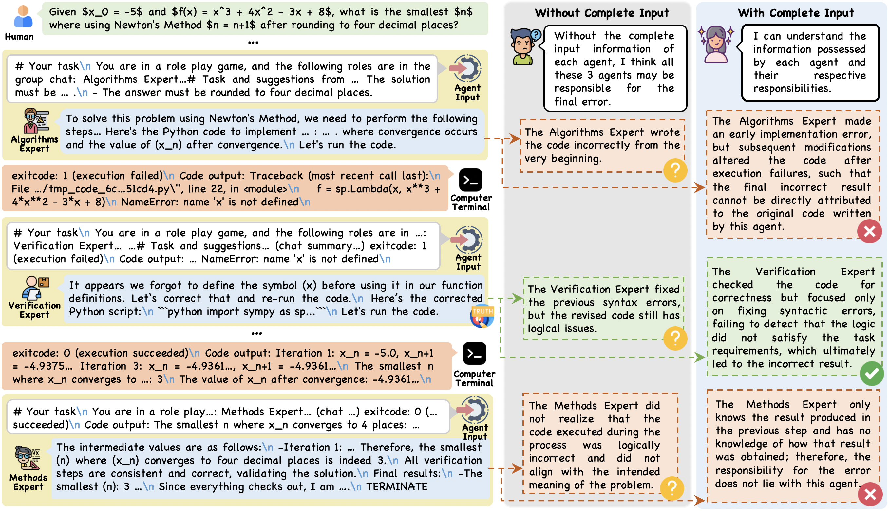

<p align="center">
  
</p>

## 🧐 Overview

<div align="center">
    
</div>

This repository provides the benchmark and evaluation framework for the paper **“Seeing the Whole Elephant: A Benchmark for Failure Attribution in LLM-based Multi-Agent Systems.”**

We study **failure attribution** in LLM-based multi-agent systems (MAS), aiming to automatically identify:

- **Which agent** is responsible for a failure (*who*), and  
- **Which execution step** makes the failure inevitable (*when*).

Unlike existing benchmarks that rely on **output-only** traces, **TraceElephant is designed for developer-facing debugging scenarios**, providing **fully observable execution traces** together with **reproducible execution environments**. Here is a case showing the difference:
 
<div align="center">
    
</div>

---

## 🚀 Why Failure Attribution?

Automated failure attribution offers several key advantages:

- **Reduces manual debugging effort**  
  Avoids labor-intensive inspection of long, interleaved agent logs.

- **Improves debugging precision**  
  Pinpoints both the responsible agent *and* the decisive failure step.

- **Enables actionable system improvements**  
  Supports targeted fixes, architectural refinement, and robustness analysis.

- **Facilitates agent self-improvement**  
  Failure attribution signals can be used for agent self-correction or as rewards in reinforcement learning.

---

## 🐘 TraceElephant: Benchmark for Developer-Facing Failure Attribution

TraceElephant is the **first benchmark** that studies failure attribution in LLM-based MAS under **full execution observability**.

### 📊 Dataset Highlights

- **220** annotated failure traces collected from **380** total executions
- **3 representative multi-agent systems**:
  - **[Captain-Agent](https://docs.ag2.ai/latest/docs/use-cases/notebooks/notebooks/agentchat_captainagent/)** (dynamic team assembly)
  - **[Magentic-One](https://www.microsoft.com/en-us/research/articles/magentic-one-a-generalist-multi-agent-system-for-solving-complex-tasks/)** (centrally orchestrated MAS)
  - **[SWE-Agent](https://github.com/SWE-agent/SWE-agent/)** (software engineering agents)
- **Diverse task sources**:
  - [GAIA](https://huggingface.co/datasets/gaia-benchmark/GAIA)
  - [AssistantBench](https://huggingface.co/datasets/AssistantBench/AssistantBench)
  - [SWE-Bench Verified](https://huggingface.co/datasets/princeton-nlp/SWE-bench_Verified)

### 🧠 Fine-grained Annotations

Each failed trace is annotated with:

- **Failure-responsible agent**
- **Decisive failure step** (earliest inevitable error)
- Expert-validated attribution labels via multi-round annotation

---

## 🔍 What Makes TraceElephant Different?

### ✅ Full Execution Traces

Each trace records:

- Agent inputs **and** outputs
- Inter-agent messages
- Tool invocations and raw logs
- System configuration and architecture metadata

This removes ambiguity caused by missing inputs in output-only logs.

---

### 🔁 Reproducible & Executable Agent System Environments

We provide the **executable agent system code** used to generate each execution trace, allowing researchers and developers to **reproduce the original agent behaviors** rather than treating traces as static artifacts.

We believe access to runnable agent systems is critical for:

* **Understanding why and how failures emerge** in multi-agent executions,
* **Diving into the internal execution mechanisms** of agent coordination, planning, and tool use,
* **Collecting additional traces or variants** beyond the released benchmark instances.

By releasing runnable code environments, TraceElephant also enables **dynamic failure attribution methods**, which go beyond static log inspection and open up possibilities such as:

* **Trace replay from intermediate steps**,
* **Controlled intervention or modification of agent inputs**,
* **Counterfactual execution analysis** to validate attribution hypotheses.

We believe that **locating and attributing agent failure trajectories is primarily a developer-centric need**—that is, developers aim to automatically analyze erroneous execution traces in order to better diagnose, debug, and optimize agent systems. We hope that our work can provide useful insights and inspiration to the community.

You can see agent system code in [`code/agent_system`](./code/agent_system/AGENT_SYSTEM.md) dir.

---

## 🛠 Collect Your Own Trace Data

You can use our [LLM API Middleware](./code/llm_api_middleware/README.md) to collect your data. 

You can also modify the middleware code to implement other dynamic functionalities, such as intercepting and modifying LLM API requests and responses. The LLM API middleware is non-intrusive and does not require changes to the original codebase.

You can also run the three agent systems in our method; please refer to the [README](./code/agent_system/AGENT_SYSTEM.md) for detailed instructions.


## 💡 Evaluations

You need to dowload our dataset in [huggingface](https://huggingface.co/datasets/TraceElephant/TraceElephant).

We have already implemented a one-click execution program:

```bash
cd trace_locate

bash run_test.sh
```

See details in `code/trace_locate`.

---

## 📖 Reference

> If you like TraceElephant, please also consider starring ⭐ the repository to support our work.

If you use **TraceElephant** in your research or find this repository helpful, please consider citing our work:

```bibtex
@misc{2026traceelephant,
    title={TraceElephant: Seeing the Whole Elephant for Failure Attribution in LLM-based Multi-Agent Systems},
    author={Anonymous},
    howpublished={\url{https://github.com/TraceElephant/TraceElephant}},
    year={2026}
}
```